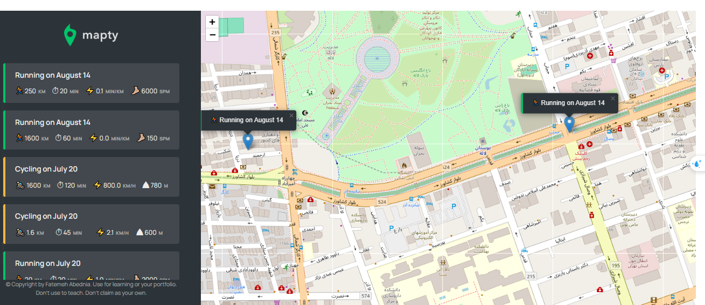

# 🗺️ Mapty – Workout Tracker

A location-based workout tracking web application built with **HTML**, **CSS**, and **Vanilla JavaScript**.

This application allows users to record **running** and **cycling** workouts by selecting a location on an interactive map. Each workout is saved locally, allowing data to persist even after the browser is refreshed.

---

## ✨ Features

* 🏃 Log running workouts
* 🚴 Log cycling workouts
* 📍 Select workout locations directly on the map
* 🗺️ Display workout markers on an interactive map
* 📋 View workout details in a clean sidebar
* 🎯 Automatically focus the map on a selected workout
* 💾 Save workouts using Local Storage
* 📱 Responsive and user-friendly interface

---

## 🛠️ Built With

* 🌐 HTML5
* 🎨 CSS3
* ⚡ JavaScript (ES6+)
* 🗺️ Leaflet.js
* 📍 Geolocation API
* 💾 Local Storage

---

## 🧠 JavaScript Concepts Practiced

This project helped strengthen my understanding of:

* Object-Oriented Programming (OOP)
* ES6 Classes
* Inheritance
* DOM Manipulation
* Event Handling
* Event Delegation
* Browser APIs
* Geolocation API
* Local Storage
* Array Methods
* Application State Management

---

### Run the project

1. Open the project in **Visual Studio Code**.
2. Install the **Live Server** extension (if you haven't already).
3. Open `index.html`.
4. Click **Go Live** or choose **Open with Live Server**.

The application will launch in your default browser.

---

## 📁 Project Structure

```text
mapty-workout-tracker/
│
├── css/
│   └── style.css
│
├── img/
│   └── ...
│
├── js/
│   └── script.js
│
├── index.html
└── README.md
```

---

## 🎯 What I Learned

During this project, I gained practical experience in:

* Building interactive web applications with Vanilla JavaScript
* Working with browser APIs such as Geolocation
* Displaying dynamic content on an interactive map
* Managing application state using OOP principles
* Persisting user data with Local Storage
* Organizing JavaScript code for better readability and maintainability

---

## 📸 Preview

```md

```

---

## 🌍 Live Demo


```text
[View Live Demo](https://fatemeh-abed.github.io/mapty-workout-tracker/)
```

---

## 🙏 Acknowledgments

This project was built as part of **Jonas Schmedtmann's Complete JavaScript Course**.

It has been used as a learning project to practice modern JavaScript concepts, browser APIs, and object-oriented programming.

---

## 👩‍💻 Author

**Fatemeh Abednia**

GitHub: https://github.com/fatemeh-abed

⭐ If you enjoyed this project, consider giving it a star!
